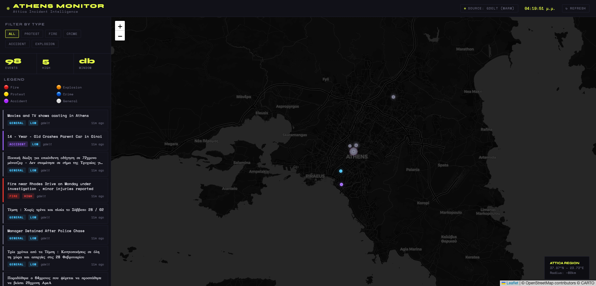

# Athens Monitor

Athens Monitor is a real-time city incident monitoring system that ingests external event sources, normalizes data, stores it persistently, and exposes a read-optimized API for map-based visualization and analytics.

The project is designed with production-oriented architecture principles, including containerization, service separation, and persistent storage.



## Architecture Overview

The system consists of three core components:

### 1. Ingestion Worker

- Polls external data sources on a schedule
- Normalizes incident data
- Writes to PostgreSQL using idempotent upsert logic
- Runs independently from the web API

### 2. PostgreSQL Database

- Persistent storage for all incidents
- Indexed for time and status filtering
- Designed to support future analytics and scaling

### 3. API Service

- Read-only service for incident retrieval
- Supports filtering by:
  - status
  - confidence
  - time range
- Optimized for map-based frontends

## Data Model

Each incident record contains:

- Unique ID (UUID)
- Title and description
- Latitude and longitude
- Severity
- Confidence score
- Source identifier
- First and last seen timestamps
- Lifecycle status (active/resolved/expired)

The system is designed to support historical queries and future analytical extensions.

## Running Locally

The entire system runs via Docker.

### Requirements

- Docker
- Docker Compose

### Start the system

```bash
docker compose up --build
```

This starts:

- API service
- Ingestion worker
- PostgreSQL database

Data is persisted via Docker volumes.

## Design Principles

- Persistent storage (no in-memory production state)
- Idempotent ingestion
- Service separation (worker and API)
- Containerized deployment
- Scalable read-oriented API design

## Future Directions

The current architecture supports:

- Multi-source ingestion
- Analytical transformation layers
- Geospatial extensions
- Historical trend analysis
- Scalable cloud deployment
